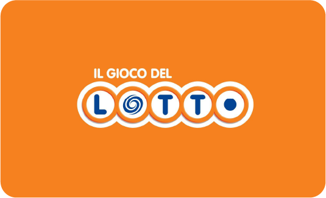

<p align="center">
  
</p>

<h1 align="center">🎱 Il Gioco del Lotto – Simulatore Didattico</h1>

<p align="center">
  <strong>Un simulatore interattivo e fedele del Gioco del Lotto italiano, pensato per lo studio della probabilità e della statistica.</strong>
</p>

<p align="center">
  <a href="https://giocodellotto.lovable.app">🌐 Demo Live</a> ·
  <a href="INSTALLING.md">📦 Installazione</a> ·
  <a href="CONTRIBUTING.md">🤝 Contribuire</a> ·
  <a href="LICENSE">📜 Licenza</a>
</p>

<p align="center">
  
  
  
  
  
  
</p>

---

## 📋 Indice

- [Panoramica](#-panoramica)
- [Funzionalità](#-funzionalità)
- [Demo](#-demo)
- [Architettura](#-architettura)
- [Stack Tecnologico](#-stack-tecnologico)
- [Installazione Rapida](#-installazione-rapida)
- [Struttura del Progetto](#-struttura-del-progetto)
- [Motore Matematico](#-motore-matematico)
- [Design System](#-design-system)
- [Accessibilità](#-accessibilità)
- [Testing](#-testing)
- [Vibe Coding & AI](#-vibe-coding--ai)
- [Contribuire](#-contribuire)
- [Licenza](#-licenza)
- [Disclaimer](#%EF%B8%8F-disclaimer)

---

## 🎯 Panoramica

Questo progetto è un **simulatore completamente funzionale del Gioco del Lotto italiano**, costruito come applicazione web moderna single-page. Non coinvolge denaro reale: il suo scopo è puramente **educativo e didattico**, permettendo di esplorare concetti di probabilità, combinatoria e statistica in modo interattivo e visivamente accattivante.

Il simulatore riproduce fedelmente le meccaniche ufficiali del Lotto gestito dall'Agenzia delle Dogane e dei Monopoli:

- **11 ruote** (Bari, Cagliari, Firenze, Genova, Milano, Napoli, Palermo, Roma, Torino, Venezia, Nazionale)
- **5 tipi di sorte** (Estratto, Ambo, Terno, Quaterna, Cinquina)
- **Moltiplicatori di vincita reali** basati sulle tabelle ufficiali
- **Calcolo probabilistico esatto** tramite combinatoria

---

## ✨ Funzionalità

### 🎮 Gioco
| Funzione | Descrizione |
|----------|-------------|
| **Selezione numeri** | Griglia interattiva 1–90, fino a 10 numeri selezionabili |
| **Selezione ruote** | Toggle singola o "Tutte" per le 11 ruote |
| **Importi per sorte** | Configurazione indipendente per ciascun tipo di sorte (€0,25 – €200) |
| **Estrazione animata** | Simulazione con animazione di 2 secondi |
| **Evidenziazione vincite** | Numeri indovinati evidenziati in verde nella griglia e nella tabella |

### 📊 Statistiche e Probabilità
| Funzione | Descrizione |
|----------|-------------|
| **Pannello probabilità** | Calcolo in tempo reale con formule combinatorie visibili |
| **Storico giocate** | Registro delle ultime 50 giocate con dettagli vincite |
| **Statistiche sessione** | Totale speso, vinto, numero giocate, percentuale vittorie |
| **ROI sessione** | Indicatore di rendimento con colore dinamico |

### 📖 Informativa
| Funzione | Descrizione |
|----------|-------------|
| **Modale regole** | Regolamento completo del Lotto con esempi di vincita |
| **Disclaimer responsabile** | Avvertenze sul gioco d'azzardo con numero verde |
| **Footer informativo** | Tre card tematiche: avvertenza, proprietà intellettuale, nota AI |

---

## 🌐 Demo

**[▶ Prova il simulatore live](https://giocodellotto.lovable.app)**

L'applicazione è completamente client-side: nessun dato viene inviato a server esterni. Tutto il calcolo avviene nel browser.

---

## 🏗 Architettura

Il progetto segue un'architettura **component-based** con separazione netta tra logica, presentazione e tipi:

```
┌─────────────────────────────────────────────┐
│                   Index.tsx                  │  ← Pagina principale (layout)
│  ┌──────────────┐  ┌─────────────────────┐  │
│  │   Schedina    │  │  Colonna Risultati  │  │
│  │  ┌──────────┐ │  │  ┌───────────────┐  │  │
│  │  │ Griglia  │ │  │  │  Tabella      │  │  │
│  │  │ Numeri   │ │  │  │  Estrazione   │  │  │
│  │  └──────────┘ │  │  └───────────────┘  │  │
│  │  ┌──────────┐ │  │  ┌───────────────┐  │  │
│  │  │ Selettore│ │  │  │  Pannello     │  │  │
│  │  │ Ruote    │ │  │  │  Probabilità  │  │  │
│  │  └──────────┘ │  │  └───────────────┘  │  │
│  │  ┌──────────┐ │  │  ┌───────────────┐  │  │
│  │  │ Importi  │ │  │  │  Storico      │  │  │
│  │  │ Sorte    │ │  │  │  Giocate      │  │  │
│  │  └──────────┘ │  │  └───────────────┘  │  │
│  └──────────────┘  └─────────────────────┘  │
└─────────────────────────────────────────────┘
         │                      │
    ┌────▼──────────────────────▼────┐
    │         useLotto() Hook        │  ← State management centralizzato
    │  ┌─────────────────────────┐   │
    │  │      engine.ts          │   │  ← Motore matematico puro
    │  │  (probabilità, vincite) │   │
    │  └─────────────────────────┘   │
    │  ┌─────────────────────────┐   │
    │  │      types.ts           │   │  ← TypeScript types e costanti
    │  └─────────────────────────┘   │
    └────────────────────────────────┘
```

### Principi di design

- **Separazione dei concern**: Il motore matematico (`engine.ts`) è una libreria pura senza dipendenze React
- **Custom hook centralizzato**: `useLotto()` gestisce tutto lo stato dell'applicazione
- **Componenti presentazionali**: I componenti UI ricevono dati via props e sono facilmente testabili
- **Type-safety**: Tipi TypeScript rigorosi per ruote, sorti, importi e risultati
- **Design system coerente**: Token CSS semantici e componenti shadcn/ui personalizzati

---

## 🛠 Stack Tecnologico

| Tecnologia | Versione | Utilizzo |
|-----------|---------|----------|
| [React](https://react.dev) | 18.3 | Framework UI con hooks |
| [TypeScript](https://typescriptlang.org) | 5.8 | Type safety e DX |
| [Vite](https://vite.dev) | 5.4 | Build tool e dev server |
| [Tailwind CSS](https://tailwindcss.com) | 3.4 | Utility-first CSS |
| [shadcn/ui](https://ui.shadcn.com) | latest | Componenti UI accessibili (Radix) |
| [Radix UI](https://radix-ui.com) | latest | Primitive UI headless |
| [Lucide React](https://lucide.dev) | 0.462 | Iconografia |
| [React Router](https://reactrouter.com) | 6.30 | Routing client-side |
| [Recharts](https://recharts.org) | 2.15 | Grafici e visualizzazioni |
| [Vitest](https://vitest.dev) | 3.2 | Testing framework |
| [DM Sans](https://fonts.google.com/specimen/DM+Sans) | — | Font principale |

---

## 🚀 Installazione Rapida

```bash
# Clona il repository
git clone https://github.com/carellonicolo/giocodellotto.git
cd giocodellotto

# Installa le dipendenze
npm install

# Avvia il server di sviluppo
npm run dev
```

Per istruzioni dettagliate, requisiti di sistema e configurazione avanzata, consulta **[INSTALLING.md](INSTALLING.md)**.

---

## 📁 Struttura del Progetto

```
src/
├── assets/                    # Risorse statiche (logo, sfondo)
│   ├── lotto-logo.png        # Logo ufficiale
│   └── wallpaper-bg.jpg      # Sfondo decorativo
├── components/
│   ├── lotto/                # Componenti specifici del gioco
│   │   ├── GrigliaNumeri.tsx       # Griglia 1-90 interattiva
│   │   ├── SelettoreRuote.tsx      # Selettore delle 11 ruote
│   │   ├── SelettoreSorteImporti.tsx  # Configurazione importi per sorte
│   │   ├── SelettoreImporto.tsx    # Singolo selettore importo
│   │   ├── SelettoreTipo.tsx       # Selettore tipo giocata
│   │   ├── TabellaEstrazione.tsx   # Tabella risultati estrazione
│   │   ├── PannelloProbabilita.tsx # Pannello analisi probabilistica
│   │   ├── StoricoGiocate.tsx      # Registro storico giocate
│   │   └── RegoleLottoModal.tsx    # Modale con regolamento completo
│   └── ui/                   # Componenti shadcn/ui (design system)
│       ├── button.tsx
│       ├── dialog.tsx
│       ├── card.tsx
│       └── ... (30+ componenti)
├── hooks/
│   ├── use-lotto.ts          # Hook principale – stato e logica di gioco
│   └── use-mobile.tsx        # Rilevamento viewport mobile
├── lib/
│   ├── lotto/
│   │   ├── engine.ts         # 🧮 Motore matematico (probabilità, vincite, formule)
│   │   └── types.ts          # TypeScript types, costanti, interfacce
│   └── utils.ts              # Utility generiche (cn, classnames)
├── pages/
│   ├── Index.tsx             # Pagina principale del simulatore
│   └── NotFound.tsx          # Pagina 404
├── test/
│   ├── example.test.ts       # Test di esempio
│   └── setup.ts              # Configurazione test
├── App.tsx                   # Root component con router
├── App.css                   # Stili globali aggiuntivi
├── index.css                 # Design system (CSS custom properties)
└── main.tsx                  # Entry point
```

---

## 🧮 Motore Matematico

Il cuore del simulatore è il file `engine.ts`, una libreria matematica pura che implementa:

### Combinatoria

```
C(n, k) = n! / (k! × (n - k)!)
```

Utilizzata per calcolare le combinazioni possibili di numeri estratti.

### Probabilità di vincita

Per un tipo di sorte *t* con *k* numeri giocati su una singola ruota:

```
P(vincita) = Σ [C(k, j) × C(90 - k, 5 - j)] / C(90, 5)
             j=t..min(k,5)
```

### Moltiplicatori di vincita

I moltiplicatori sono quelli **ufficiali del Lotto italiano** per €1 di puntata:

| Sorte | Min. numeri | Moltiplicatore (con min. numeri) |
|-------|-------------|----------------------------------|
| Estratto | 1 | ×11,23 |
| Ambo | 2 | ×250 |
| Terno | 3 | ×4.500 |
| Quaterna | 4 | ×120.000 |
| Cinquina | 5 | ×6.000.000 |

I moltiplicatori decrescono all'aumentare dei numeri giocati, come nel regolamento ufficiale.

### Calcolo vincita

```
Vincita = Importo × Moltiplicatore × C(indovinati, t) / C(giocati, t)
```

---

## 🎨 Design System

L'interfaccia è costruita su un **design system custom** ispirato alla schedina cartacea del Lotto:

### Token di colore (HSL)

| Token | Valore | Utilizzo |
|-------|--------|----------|
| `--lotto-orange` | `15 85% 55%` | Colore primario, header, CTA |
| `--lotto-peach` | `25 80% 88%` | Sfondo schedina |
| `--lotto-salmon` | `15 55% 45%` | Titoli sezione, bordi |
| `--lotto-gold` | `45 80% 55%` | Vincite, highlight |
| `--lotto-blue` | `210 60% 45%` | Accenti informativi |
| `--lotto-green` | `145 55% 32%` | Numeri indovinati |
| `--lotto-red` | `0 70% 42%` | Avvertenze |
| `--lotto-cream` | `35 40% 94%` | Sfondo chiaro |

### Classi custom

- `.schedina-card` – Card con gradiente peach→cream e bordo arancione
- `.schedina-header` – Header con gradiente arancione
- `.schedina-section-title` – Titoli di sezione stile schedina
- `.lotto-bubble` – Bolle numeriche interattive con stati (default, selected, matched)
- `.ruota-row` – Riga selettore ruota

### Supporto Dark Mode

Il design system include una modalità scura completa con tutti i token ricalibrati per leggibilità su sfondo scuro.

---

## ♿ Accessibilità

Il progetto è sviluppato con attenzione all'accessibilità (WCAG 2.1):

- ✅ **Landmark semantici**: `<main>` come landmark principale
- ✅ **ARIA labels**: Tutti i pulsanti interattivi hanno nomi accessibili
- ✅ **Componenti Radix UI**: Accessibilità built-in (focus management, keyboard navigation)
- ✅ **Contrasto colori**: Token ottimizzati per rapporti di contrasto adeguati
- ✅ **Responsive design**: Layout adattivo mobile-first (320px → 1920px)
- ✅ **Font leggibili**: DM Sans con dimensioni e spaziatura ottimizzate

---

## 🧪 Testing

Il progetto utilizza **Vitest** come framework di testing:

```bash
# Esegui tutti i test
npm test

# Esegui test in modalità watch
npm run test:watch
```

I test coprono il motore matematico (`engine.ts`) e la logica di gioco.

---

## 🤖 Vibe Coding & AI

Questo progetto è stato sviluppato utilizzando la metodologia del **vibe coding**: un approccio alla programmazione in cui il developer guida agenti AI attraverso prompt in linguaggio naturale per generare, iterare e raffinare il codice.

### Cosa significa in pratica

- La **visione del prodotto**, le **specifiche funzionali** e le **scelte architetturali** sono state definite da un essere umano
- Il **codice sorgente** è stato generato e raffinato iterativamente tramite agenti AI specializzati nella generazione di codice
- Il **motore matematico** è stato validato confrontando i risultati con le tabelle ufficiali del Lotto
- Il **design system** è stato progettato attraverso prompt dettagliati che descrivono l'estetica desiderata
- Ogni componente è stato **testato e revisionato** dal developer per garantire correttezza e qualità

### Perché menzionarlo

La trasparenza sull'utilizzo dell'AI nella creazione del software è un principio importante. Questo progetto dimostra come il vibe coding possa produrre applicazioni complete, ben strutturate e funzionali, mantenendo il developer nel ruolo di **architetto e supervisore** del processo.

---

## 🤝 Contribuire

I contributi sono benvenuti! Consulta **[CONTRIBUTING.md](CONTRIBUTING.md)** per le linee guida complete.

In breve:
1. Forka il repository
2. Crea un branch per la tua feature (`git checkout -b feature/nome-feature`)
3. Committa le modifiche (`git commit -m 'Aggiunge nuova feature'`)
4. Pusha il branch (`git push origin feature/nome-feature`)
5. Apri una Pull Request

---

## 📜 Licenza

Distribuito con licenza **MIT**. Vedi [LICENSE](LICENSE) per il testo completo.

---

## ⚠️ Disclaimer

> **Il gioco d'azzardo può causare dipendenza patologica.** Gioca responsabilmente e solo se maggiorenne.
> Per informazioni e aiuto: **Telefono Verde 800 558 822** (ISS – Istituto Superiore di Sanità).

- Il marchio "Gioco del Lotto" è di proprietà esclusiva dello Stato italiano, gestito da Lottomatica S.p.A. su concessione dell'Agenzia delle Dogane e dei Monopoli
- Questa applicazione **non è affiliata né autorizzata** da tali enti
- Il software ha il **solo scopo di studio della probabilità e della statistica**
- **Nessuna somma di denaro reale è coinvolta**

---

<p align="center">
  Made with 🎱 in Italy · Powered by vibe coding & AI agents
</p>
